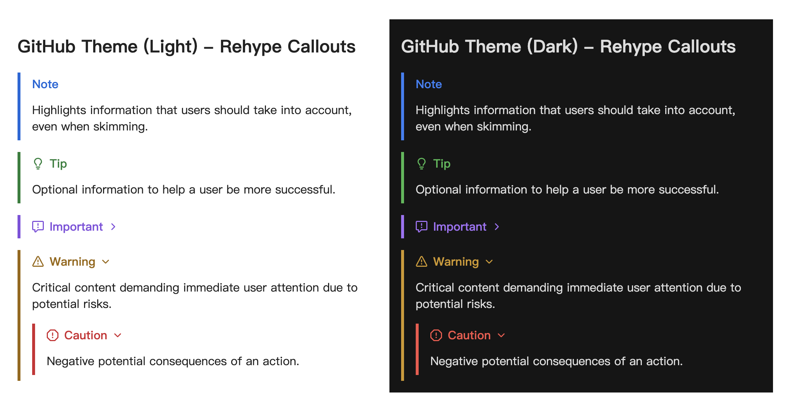
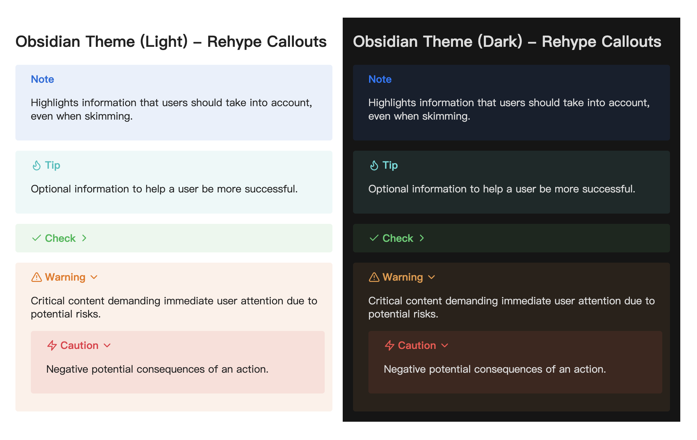
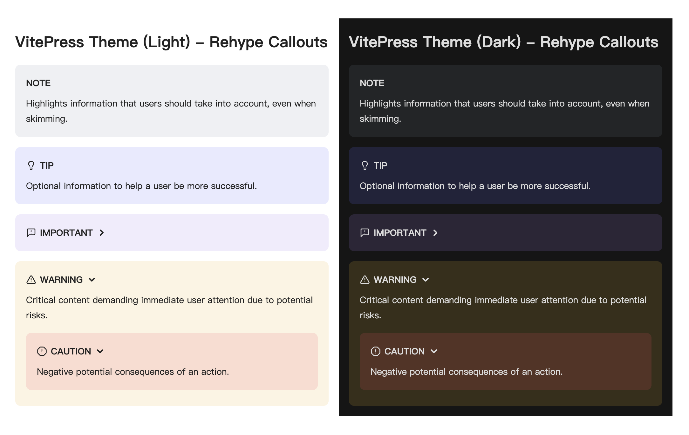

# rehype-callouts

[![version][version-badge]][version-link]
[![codecov][coverage-badge]][coverage]
[![npm downloads][npm-downloads-src]][npm-downloads-href]
[![jsDocs.io][jsdocs-src]][jsdocs-href]

A [rehype](https://github.com/rehypejs/rehype) plugin for processing and rendering blockquote-based callouts.

## What is this?

This plugin adds support for callouts (admonitions/alerts), allowing you to use [Obsidian's callout syntax](https://help.obsidian.md/Editing+and+formatting/Callouts) uniformly in markdown to achieve the following features:

- Includes default callout types for various themes.
- Optionally import stylesheets for corresponding [themes](#themes).
- Supports collapsible callouts with `-/+` and nestable callouts.
- Allows custom titles with markdown syntax.
- Customizable default callout types (title, icon, color).
- Configurable new callout types.
- Configurable aliases for callout types.
- Configurable icon display.

## When should I use this?

This plugin helps render markdown callouts, making it ideal for displaying Obsidian callouts on an Astro-powered blog.

It also modifies HTML directly (no `allowDangerousHtml` in [remark-rehype](https://github.com/remarkjs/remark-rehype)) and supports collapsible callouts using the `details` tag, all without JavaScript.

## Installation

This package is [ESM only](https://gist.github.com/sindresorhus/a39789f98801d908bbc7ff3ecc99d99c). In Node.js (version 16+), install with your package manager:

```sh
npm install rehype-callouts
yarn add rehype-callouts
pnpm add rehype-callouts
```

In Deno with [`esm.sh`](https://esm.sh/):

```js
import rehypeCallouts from 'https://esm.sh/rehype-callouts'
```

In browsers with [`esm.sh`](https://esm.sh/):

```html
<script type="module">
  import rehypeCallouts from 'https://esm.sh/rehype-callouts?bundle'
</script>
```

## Usage

Say `example.md` contains:

```md
<!-- Callout type names are case-insensitive: 'Note', 'NOTE', and 'note' are equivalent. -->

> [!note] This is a _non-collapsible_ callout
> Some content is displayed directly!

> [!WARNING]- This is a **collapsible** callout
> Some content shown after opening!
```

And module `example.js` contains:

```js
import { unified } from 'unified'
import remarkParse from 'remark-parse'
import remarkRehype from 'remark-rehype'
import rehypeCallouts from 'rehype-callouts'
import rehypeStringify from 'rehype-stringify'
import { readSync } from 'to-vfile'

const file = unified()
  .use(remarkParse)
  .use(remarkRehype)
  .use(rehypeCallouts)
  .use(rehypeStringify)
  .processSync(readSync('example.md'))

console.log(String(file))
```

Or for an Astro project, the `astro.config.ts` contains:

```ts
import { defineConfig } from 'astro/config'
import rehypeCallouts from 'rehype-callouts'

// https://docs.astro.build/en/reference/configuration-reference/
export default defineConfig({
  // ...
  markdown: {
    // ...
    rehypePlugins: [
      // ...
      rehypeCallouts,
    ],
  },
  // ...
})
```

Then running `node example.js` or `pnpm astro dev` yields:

```html
<div
  dir="auto"
  class="callout"
  style="--callout-color-light: rgb(8, 109, 221); --callout-color-dark: rgb(2, 122, 255);"
>
  <div class="callout-title">
    <div class="callout-icon">
      <!-- svg icon-->
    </div>
    <div class="callout-title-inner">
      This is a <em>non-collapsible</em> callout
    </div>
  </div>
  <div class="callout-content">
    <p>Some content is displayed directly!</p>
  </div>
</div>

<details
  dir="auto"
  class="callout callout-collapsible"
  style="--callout-color-light: rgb(236, 117, 0); --callout-color-dark: rgb(233, 151, 63);"
>
  <summary class="callout-title">
    <div class="callout-icon">
      <!-- svg icon-->
    </div>
    <div class="callout-title-inner">
      This is a <strong>collapsible</strong> callout
    </div>
    <div class="callout-fold">
      <!-- svg icon-->
    </div>
  </summary>
  <div class="callout-content">
    <p>Some content shown after opening!</p>
  </div>
</details>
```

### Styling

You can customize callout styles using the class names mentioned above or import the provided [theme-specific](#themes) stylesheets:

```ts
import 'rehype-callouts/theme/github'
import 'rehype-callouts/theme/obsidian'
import 'rehype-callouts/theme/vitepress'
```

If bundling CSS files, import the CSS in your main CSS file:

```css
@import 'rehype-callouts/theme/github';
```

For Sass, import the CSS in your main Sass file:

```scss
@use 'rehype-callouts/theme/github';
```

Alternatively, import the CSS directly in browsers via [unpkg.com](https://unpkg.com) or [jsdelivr.net](https://www.jsdelivr.com/):

```html
<link
  rel="stylesheet"
  href="https://unpkg.com/rehype-callouts/dist/themes/github/index.css"
/>
<link
  rel="stylesheet"
  href="https://cdn.jsdelivr.net/npm/rehype-callouts/dist/themes/github/index.css"
/>
```

## API

This package exports no identifiers. The default export is `rehypeCallouts`.

### `unified().use(rehypeCallouts, options?)`

Used to render callouts, including an optional parameter [`options`](#options).

### `options: UserOptions`

You can configure this plugin with the following optional settings:

| Option                                           | Type (default)                                                                                                                       | Description                                                                                                                        |
| ------------------------------------------------ | ------------------------------------------------------------------------------------------------------------------------------------ | ---------------------------------------------------------------------------------------------------------------------------------- |
| theme                                            | `'github'\|'obsidian'\|'vitepress'`<br>(default: `'obsidian'`)                                                                       | Specifies your desired callout theme to automatically apply its default callout types.                                             |
| [callouts](#callouts-recordstring-calloutconfig) | `Record<string, CalloutConfig>` (default: see [source code](https://github.com/lin-stephanie/rehype-callouts/tree/main/src/themes) ) | Defines the properties for default and custom callouts. For example: `{'note': {title: 'CustomTitle'}, 'custom': {color: 'pink'}}` |
| aliases                                          | `Record<string, string[]>` (default: `{}`)                                                                                           | Configures aliases for callout types. For example: `{'note': ['n'], 'tip': ['t']}`                                                 |
| showIndicator                                    | `boolean`(default: `true`)                                                                                                           | Whether to display an type-specific icons before callout title.                                                                    |
| [htmlTagNames](#htmltagnames-htmltagnamesconfig) | `HtmlTagNamesConfig`(default: `'div'`)                                                                                               | Configures HTML tag names for elements within the callout structure for semantic flexibility.                                      |

### `callouts: Record<string, CalloutConfig>`

Defines properties for default and custom callouts. Each key represents a callout type, and the value is an object with the following optional properties:

| Property  | Type                         | Description                                                                                                                                                                                                                                                                                                        |
| --------- | ---------------------------- | ------------------------------------------------------------------------------------------------------------------------------------------------------------------------------------------------------------------------------------------------------------------------------------------------------------------ |
| title     | `string`                     | Title for this callout type. For new callout types, defaults to the callout type name if unset.                                                                                                                                                                                                                    |
| indicator | `string`                     | Icon in SVG format as a string. For new callout types, the icon will not display unless set, even if `showIndicator` is `true`. You can get icons from [Iconify](https://icon-sets.iconify.design/). For example: `'<svg>...</svg>'`                                                                               |
| color     | `string \| [string, string]` | Color(s) as a [`<color>`](https://developer.mozilla.org/en-US/docs/Web/CSS/color_value#syntax) string. For new callout types, defaults to `#888` if unset. For example:<br>`'rgb(8, 109, 221)'`: works for both light and dark themes.<br>`['#0969da', '#2f81f7']` : first for light theme, second for dark theme. |

### `htmlTagNames: HtmlTagNamesConfig`

Configures HTML tag names for elements within the callout structure for semantic flexibility. Note that custom HTML tag names may affect default package styling; check and adjust styles as needed.

| Property                       | Type     | Description                                                                                                                                   |
| ------------------------------ | -------- | --------------------------------------------------------------------------------------------------------------------------------------------- |
| nonCollapsibleContainerTagName | `string` | Tag name for the outer container of non-collapsible callouts. For collapsible callouts, the tag name is fixed to `details` for functionality. |
| nonCollapsibleTitleTagName     | `string` | Tag name for the title container of non-collapsible callouts. For collapsible callouts, the tag name is fixed to `summary` for functionality. |
| nonCollapsibleContentTagName   | `string` | Tag name for the content container of non-collapsible callouts.                                                                               |
| collapsibleContentTagName      | `string` | Tag name for the content container of collapsible callouts.                                                                                   |
| iconTagName                    | `string` | Tag name for the icon container in both collapsible and non-collapsible callouts, including the fold icon in collapsible ones.                |
| titleInnerTagName              | `string` | Tag name for the inner container of the title text in both collapsible and non-collapsible callouts.                                          |

## Themes

This package provides callout styles for [GitHub](https://github.com/orgs/community/discussions/16925), [Obsidian](https://help.obsidian.md/Editing+and+formatting/Callouts), and [VitePress](https://vitepress.dev/guide/markdown#github-flavored-alerts), with dark mode support via the `.dark` class. For more, check the [source code](https://github.com/lin-stephanie/rehype-callouts/tree/main/src/themes).

### GitHub



### Obsidian



### VitePress



## Types

This package is fully typed with [TypeScript](https://www.typescriptlang.org/). See [jsDocs.io](https://www.jsdocs.io/package/rehype-callouts) for type details.

## Credits

- [staticnoise/rehype-obsidian-callout](https://gitlab.com/staticnoise/rehype-obsidian-callout) - basic functionality.
- [Octions](https://primer.style/foundations/icons/) - default icons for GitHub callouts.
- [Lucide](https://lucide.dev/) - default icons for Obsidian, VitePress callouts.

## Contribution

If you see any errors or room for improvement on this plugin, feel free to open an [issues](https://github.com/lin-stephanie/rehype-callouts/issues) or [pull request](https://github.com/lin-stephanie/rehype-callouts/pulls) . Thank you in advance for contributing!

## License

[MIT](https://github.com/lin-stephanie/rehype-callouts/blob/main/LICENSE) © 2024-PRESENT [Stephanie Lin](https://github.com/lin-stephanie)

<!-- Badges -->

[version-badge]: https://img.shields.io/github/v/release/lin-stephanie/rehype-callouts?label=release&style=flat&colorA=080f12&colorB=ef7575
[version-link]: https://github.com/lin-stephanie/rehype-callouts/releases
[coverage-badge]: https://img.shields.io/codecov/c/github/lin-stephanie/rehype-callouts?style=flat&colorA=080f12&colorB=ef7575
[coverage]: https://codecov.io/github/lin-stephanie/rehype-callouts
[npm-downloads-src]: https://img.shields.io/npm/dm/rehype-callouts?style=flat&colorA=080f12&colorB=ef7575
[npm-downloads-href]: https://npmjs.com/package/rehype-callouts
[jsdocs-src]: https://img.shields.io/badge/jsdocs-reference-080f12?style=flat&colorA=080f12&colorB=ef7575
[jsdocs-href]: https://www.jsdocs.io/package/rehype-callouts
